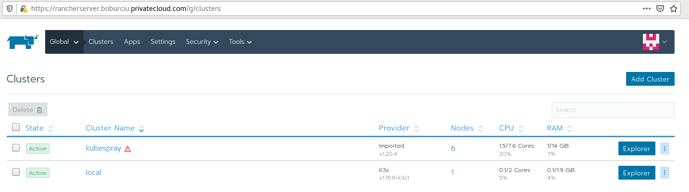
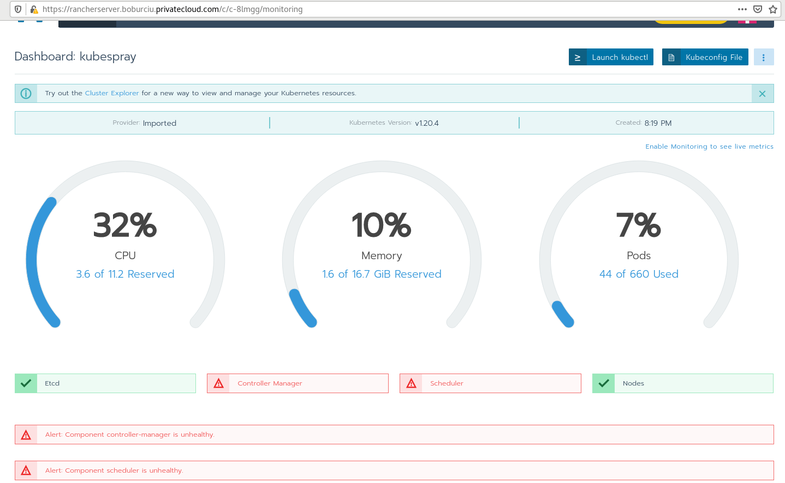

# Creating K8s cluster by [Kubespray](https://kubernetes.io/docs/setup/production-environment/tools/kubespray/) to verify OpenStackHelm installation (that fails on RKE)
 
## 0. Check prerequisites:
 ### - Linux OS version for K8s nodes: 
[boburciu@r220 Rancher_K8s_prereq]$ ` ansible ubuntu-rke -m command -a "egrep '^(VERSION|NAME)=' /etc/os-release" `
```
[WARNING]: Invalid characters were found in group names but not replaced, use -vvvv to see details
rkew2 | CHANGED | rc=0 >>
NAME="Ubuntu"
VERSION="18.04.5 LTS (Bionic Beaver)"
rkew1 | CHANGED | rc=0 >>
NAME="Ubuntu"
VERSION="18.04.5 LTS (Bionic Beaver)"
rkem1 | CHANGED | rc=0 >>
NAME="Ubuntu"
VERSION="18.04.5 LTS (Bionic Beaver)"
rkew3 | CHANGED | rc=0 >>
NAME="Ubuntu"
VERSION="18.04.5 LTS (Bionic Beaver)"
rkem2 | CHANGED | rc=0 >>
NAME="Ubuntu"
VERSION="18.04.5 LTS (Bionic Beaver)"
rkew4 | CHANGED | rc=0 >>
NAME="Ubuntu"
VERSION="18.04.5 LTS (Bionic Beaver)"
rkew5 | CHANGED | rc=0 >>
NAME="Ubuntu"
VERSION="18.04.5 LTS (Bionic Beaver)"
rkew6 | CHANGED | rc=0 >>
NAME="Ubuntu"
VERSION="18.04.5 LTS (Bionic Beaver)"
[boburciu@r220 Rancher_K8s_prereq]$
```
 ### - Linux K8s nodes all have IP forwarding enabled:
[boburciu@r220 Rancher_K8s_prereq]$ ` ansible ubuntu-rke -m command -a "cat /proc/sys/net/ipv4/ip_forward" `
```
[WARNING]: Invalid characters were found in group names but not replaced, use -vvvv to see details
rkew1 | CHANGED | rc=0 >>
1
rkew2 | CHANGED | rc=0 >>
1
rkem1 | CHANGED | rc=0 >>
1
rkem2 | CHANGED | rc=0 >>
1
rkew3 | CHANGED | rc=0 >>
1
rkew4 | CHANGED | rc=0 >>
1
rkew6 | CHANGED | rc=0 >>
1
rkew5 | CHANGED | rc=0 >>
1
[boburciu@r220 Rancher_K8s_prereq]$
```
 ### - Permit all traffic/firewall for Linux K8s intra-node communication:
[boburciu@r220 ~]$ ` ansible ubuntu-rke -m command -a "sudo ufw default allow incoming" `
```
[WARNING]: Invalid characters were found in group names but not replaced, use -vvvv to see details
[WARNING]: Consider using 'become', 'become_method', and 'become_user' rather than running sudo
rkem1 | CHANGED | rc=0 >>
Default incoming policy changed to 'allow'
(be sure to update your rules accordingly)
rkem2 | CHANGED | rc=0 >>
Default incoming policy changed to 'allow'
(be sure to update your rules accordingly)
rkew3 | CHANGED | rc=0 >>
Default incoming policy changed to 'allow'
(be sure to update your rules accordingly)
rkew1 | CHANGED | rc=0 >>
Default incoming policy changed to 'allow'
(be sure to update your rules accordingly)
rkew2 | CHANGED | rc=0 >>
Default incoming policy changed to 'allow'
(be sure to update your rules accordingly)
rkew5 | CHANGED | rc=0 >>
Default incoming policy changed to 'allow'
(be sure to update your rules accordingly)
rkew4 | CHANGED | rc=0 >>
Default incoming policy changed to 'allow'
(be sure to update your rules accordingly)
rkew6 | CHANGED | rc=0 >>
Default incoming policy changed to 'allow'
(be sure to update your rules accordingly)
```
[boburciu@r220 ~]$ ` ansible ubuntu-rke -m command -a "sudo ufw default allow outgoing" `
```
[WARNING]: Invalid characters were found in group names but not replaced, use -vvvv to see details
[WARNING]: Consider using 'become', 'become_method', and 'become_user' rather than running sudo
rkem2 | CHANGED | rc=0 >>
Default outgoing policy changed to 'allow'
(be sure to update your rules accordingly)
rkem1 | CHANGED | rc=0 >>
Default outgoing policy changed to 'allow'
(be sure to update your rules accordingly)
rkew3 | CHANGED | rc=0 >>
Default outgoing policy changed to 'allow'
(be sure to update your rules accordingly)
rkew1 | CHANGED | rc=0 >>
Default outgoing policy changed to 'allow'
(be sure to update your rules accordingly)
rkew2 | CHANGED | rc=0 >>
Default outgoing policy changed to 'allow'
(be sure to update your rules accordingly)
rkew5 | CHANGED | rc=0 >>
Default outgoing policy changed to 'allow'
(be sure to update your rules accordingly)
rkew4 | CHANGED | rc=0 >>
Default outgoing policy changed to 'allow'
(be sure to update your rules accordingly)
rkew6 | CHANGED | rc=0 >>
Default outgoing policy changed to 'allow'
(be sure to update your rules accordingly)
[boburciu@r220 ~]$
``` 
[boburciu@r220 ~]$ ` ansible ubuntu-rke-test -m command -a "sudo ufw default allow incoming" `
```
[WARNING]: Invalid characters were found in group names but not replaced, use -vvvv to see details
[WARNING]: Consider using 'become', 'become_method', and 'become_user' rather than running sudo
test | CHANGED | rc=0 >>
Default incoming policy changed to 'allow'
(be sure to update your rules accordingly)
[boburciu@r220 ~]$ 
```
[boburciu@r220 ~]$ ` ansible ubuntu-rke-test -m command -a "ss -tulw" `
```
[WARNING]: Invalid characters were found in group names but not replaced, use -vvvv to see details
test | CHANGED | rc=0 >>
NetidState  Recv-Q  Send-Q          Local Address:Port        Peer Address:Port
icmp6UNCONN 0       0                      *%ens3:ipv6-icmp              *:*
udp  UNCONN 0       0               127.0.0.53%lo:domain           0.0.0.0:*
udp  UNCONN 0       0         192.168.122.51%ens3:bootpc           0.0.0.0:*
tcp  LISTEN 0       128             127.0.0.53%lo:domain           0.0.0.0:*
tcp  LISTEN 0       128                   0.0.0.0:ssh              0.0.0.0:*
tcp  LISTEN 0       128                      [::]:ssh                 [::]:*
[boburciu@r220 ~]$
```
[boburciu@r220 ~]$ ` for i in `cat /etc/ansible/hosts | grep -A6 ubuntu-rke-workers | tail -6 | awk '{print $1}'`; do echo "-----------------------------------------------------------------------"; echo "UFW open ports on $i"; echo ""; ssh ubuntu@$i sudo ufw status verbose; done `
```
-----------------------------------------------------------------------
UFW open ports on rkew1

Status: active
Logging: on (low)
Default: allow (incoming), allow (outgoing), deny (routed)
New profiles: skip

To                         Action      From
--                         ------      ----
80/tcp                     ALLOW IN    Anywhere
443/tcp                    ALLOW IN    Anywhere
10254/tcp                  ALLOW IN    Anywhere
8181/tcp                   ALLOW IN    Anywhere
10246/tcp                  ALLOW IN    Anywhere
::/tcp                     DENY IN     Anywhere (v6)
80/tcp (v6)                ALLOW IN    Anywhere (v6)
443/tcp (v6)               ALLOW IN    Anywhere (v6)
10254/tcp (v6)             ALLOW IN    Anywhere (v6)
8181/tcp (v6)              ALLOW IN    Anywhere (v6)
10246/tcp (v6)             ALLOW IN    Anywhere (v6)

-----------------------------------------------------------------------
UFW open ports on rkew2

Status: active
Logging: on (low)
Default: allow (incoming), allow (outgoing), deny (routed)
New profiles: skip

To                         Action      From
--                         ------      ----
80/tcp                     ALLOW IN    Anywhere
443/tcp                    ALLOW IN    Anywhere
10254/tcp                  ALLOW IN    Anywhere
8181/tcp                   ALLOW IN    Anywhere
10246/tcp                  ALLOW IN    Anywhere
::/tcp                     DENY IN     Anywhere (v6)
80/tcp (v6)                ALLOW IN    Anywhere (v6)
443/tcp (v6)               ALLOW IN    Anywhere (v6)
10254/tcp (v6)             ALLOW IN    Anywhere (v6)
8181/tcp (v6)              ALLOW IN    Anywhere (v6)
10246/tcp (v6)             ALLOW IN    Anywhere (v6)

-----------------------------------------------------------------------
UFW open ports on rkew3

Status: active
Logging: on (low)
Default: allow (incoming), allow (outgoing), deny (routed)
New profiles: skip

To                         Action      From
--                         ------      ----
80/tcp                     ALLOW IN    Anywhere
443/tcp                    ALLOW IN    Anywhere
10254/tcp                  ALLOW IN    Anywhere
8181/tcp                   ALLOW IN    Anywhere
10246/tcp                  ALLOW IN    Anywhere
::/tcp                     DENY IN     Anywhere (v6)
80/tcp (v6)                ALLOW IN    Anywhere (v6)
443/tcp (v6)               ALLOW IN    Anywhere (v6)
10254/tcp (v6)             ALLOW IN    Anywhere (v6)
8181/tcp (v6)              ALLOW IN    Anywhere (v6)
10246/tcp (v6)             ALLOW IN    Anywhere (v6)

-----------------------------------------------------------------------
UFW open ports on rkew4

Status: active
Logging: on (low)
Default: allow (incoming), allow (outgoing), deny (routed)
New profiles: skip

To                         Action      From
--                         ------      ----
80/tcp                     ALLOW IN    Anywhere
443/tcp                    ALLOW IN    Anywhere
10254/tcp                  ALLOW IN    Anywhere
8181/tcp                   ALLOW IN    Anywhere
10246/tcp                  ALLOW IN    Anywhere
::/tcp                     DENY IN     Anywhere (v6)
80/tcp (v6)                ALLOW IN    Anywhere (v6)
443/tcp (v6)               ALLOW IN    Anywhere (v6)
10254/tcp (v6)             ALLOW IN    Anywhere (v6)
8181/tcp (v6)              ALLOW IN    Anywhere (v6)
10246/tcp (v6)             ALLOW IN    Anywhere (v6)

-----------------------------------------------------------------------
UFW open ports on rkew5

Status: active
Logging: on (low)
Default: allow (incoming), allow (outgoing), deny (routed)
New profiles: skip

To                         Action      From
--                         ------      ----
80/tcp                     ALLOW IN    Anywhere
443/tcp                    ALLOW IN    Anywhere
10254/tcp                  ALLOW IN    Anywhere
8181/tcp                   ALLOW IN    Anywhere
10246/tcp                  ALLOW IN    Anywhere
::/tcp                     DENY IN     Anywhere (v6)
80/tcp (v6)                ALLOW IN    Anywhere (v6)
443/tcp (v6)               ALLOW IN    Anywhere (v6)
10254/tcp (v6)             ALLOW IN    Anywhere (v6)
8181/tcp (v6)              ALLOW IN    Anywhere (v6)
10246/tcp (v6)             ALLOW IN    Anywhere (v6)

-----------------------------------------------------------------------
UFW open ports on rkew6

Status: active
Logging: on (low)
Default: allow (incoming), allow (outgoing), deny (routed)
New profiles: skip

To                         Action      From
--                         ------      ----
80/tcp                     ALLOW IN    Anywhere
443/tcp                    ALLOW IN    Anywhere
10254/tcp                  ALLOW IN    Anywhere
8181/tcp                   ALLOW IN    Anywhere
10246/tcp                  ALLOW IN    Anywhere
::/tcp                     DENY IN     Anywhere (v6)
80/tcp (v6)                ALLOW IN    Anywhere (v6)
443/tcp (v6)               ALLOW IN    Anywhere (v6)
10254/tcp (v6)             ALLOW IN    Anywhere (v6)
8181/tcp (v6)              ALLOW IN    Anywhere (v6)
10246/tcp (v6)             ALLOW IN    Anywhere (v6)

[boburciu@r220 ~]$
```
 ### - The python's netaddr module is needed on Ansible controller
[boburciu@r220 kubespray]$ ` sudo yum install python-netaddr `
 #### - The error was: 
```
:    
TASK [kubernetes/preinstall : Check that kube_service_addresses is a network range] ***********************************
fatal: [rkem1]: FAILED! => {"msg": "The conditional check 'kube_service_addresses | ipaddr('net')' failed. The error was: The ipaddr filter requires python's netaddr be installed on the ansible controller"}
```
 ### - Jinja 2.8 or higher is needed on Ansible controller to provide the  "equalto" Ansible test
[boburciu@r220 kubespray]$ ` pip install --upgrade python-jinja2 `
 #### - The error was:
```
TASK [Check_certs | Set 'etcd_member_requires_sync' to true if ca or member/admin cert and key don't exist on etcd member or checksum doesn't match] ***
fatal: [rkem1]: FAILED! => {"msg": "The conditional check '(not etcd_member_certs.results[0].stat.exists|default(false)) or (not etcd_member_certs.results[1].stat.exists|default(false)) or (not etcd_member_certs.results[2].stat.exists|default(false)) or (not etcd_member_certs.results[3].stat.exists|default(false)) or (not etcd_member_certs.results[4].stat.exists|default(false)) or (etcd_member_certs.results[0].stat.checksum|default('') != etcdcert_master.files|selectattr(\"path\", \"equalto\", etcd_member_certs.results[0].stat.path)|map(attribute=\"checksum\")|first|default('')) or (etcd_member_certs.results[1].stat.checksum|default('') != etcdcert_master.files|selectattr(\"path\", \"equalto\", etcd_member_certs.results[1].stat.path)|map(attribute=\"checksum\")|first|default('')) or (etcd_member_certs.results[2].stat.checksum|default('') != etcdcert_master.files|selectattr(\"path\", \"equalto\", etcd_member_certs.results[2].stat.path)|map(attribute=\"checksum\")|first|default('')) or (etcd_member_certs.results[3].stat.checksum|default('') != etcdcert_master.files|selectattr(\"path\", \"equalto\", etcd_member_certs.results[3].stat.path)|map(attribute=\"checksum\")|first|default('')) or (etcd_member_certs.results[4].stat.checksum|default('') != etcdcert_master.files|selectattr(\"path\", \"equalto\", etcd_member_certs.results[4].stat.path)|map(attribute=\"checksum\")|first|default(''))' failed. The error was: no test named 'equalto'\n\nThe error appears to be in '/home/boburciu/kubespray/roles/etcd/tasks/check_certs.yml': line 108, column 3, but may\nbe elsewhere in the file depending on the exact syntax problem.\n\nThe offending line appears to be:\n\n\n- name: \"Check_certs | Set 'etcd_member_requires_sync' to true if ca or member/admin cert and key don't exist on etcd member or checksum doesn't match\"\n  ^ here\nWe could be wrong, but this one looks like it might be an issue with\nunbalanced quotes. If starting a value with a quote, make sure the\nline ends with the same set of quotes. For instance this arbitrary\nexample:\n\n    foo: \"bad\" \"wolf\"\n\nCould be written as:\n\n    foo: '\"bad\" \"wolf\"'\n"}
fatal: [rkem2]: FAILED! => {"msg": "The conditional check '..
```

## 1. Create cluster prereq.
[boburciu@r220 ~]$ ` git clone https://github.com/kubernetes-sigs/kubespray.git `
```
Cloning into 'kubespray'...
remote: Enumerating objects: 10, done.
remote: Counting objects: 100% (10/10), done.
remote: Compressing objects: 100% (10/10), done.
remote: Total 51133 (delta 0), reused 0 (delta 0), pack-reused 51123
Receiving objects: 100% (51133/51133), 14.97 MiB | 2.00 MiB/s, done.
Resolving deltas: 100% (28710/28710), done.
[boburciu@r220 ~]$ cd kubespray/
[boburciu@r220 kubespray]$ 
```
 ### - The inventory file creation script requires IP@ for nodes as input vars and an odd number of etcd hosts
[boburciu@r220 kubespray]$ ` python3 contrib/inventory_builder/inventory.py help `
```
Usage: inventory.py ip1 [ip2 ...]
Examples: inventory.py 10.10.1.3 10.10.1.4 10.10.1.5

Available commands:
help - Display this message
print_cfg - Write inventory file to stdout
print_ips - Write a space-delimited list of IPs from "all" group
print_hostnames - Write a space-delimited list of Hostnames from "all" group

Advanced usage:
Add another host after initial creation: inventory.py 10.10.1.5
Add range of hosts: inventory.py 10.10.1.3-10.10.1.5
Add hosts with different ip and access ip: inventory.py 10.0.0.1,192.168.10.1 10.0.0.2,192.168.10.2 10.0.0.3,192.168.10.3
Add hosts with a specific hostname, ip, and optional access ip: first,10.0.0.1,192.168.10.1 second,10.0.0.2 last,10.0.0.3
Delete a host: inventory.py -10.10.1.3
Delete a host by id: inventory.py -node1

Configurable env vars:
DEBUG                   Enable debug printing. Default: True
CONFIG_FILE             File to write config to Default: ./inventory/sample/hosts.yaml
HOST_PREFIX             Host prefix for generated hosts. Default: node
KUBE_CONTROL_HOSTS      Set the number of kube-control-planes. Default: 2
SCALE_THRESHOLD         Separate ETCD role if # of nodes >= 50
MASSIVE_SCALE_THRESHOLD Separate K8s control-plane and ETCD if # of nodes >= 200

[boburciu@r220 kubespray]$
```
[boburciu@r220 kubespray]$ ` ansible ubuntu-rke -m command -a "hostname -I" `
```
rkew1 | CHANGED | rc=0 >>
192.168.122.180 172.17.0.1
rkew2 | CHANGED | rc=0 >>
192.168.122.167 172.17.0.1
rkem2 | CHANGED | rc=0 >>
192.168.122.144 172.17.0.1
rkem1 | CHANGED | rc=0 >>
192.168.122.192 172.17.0.1 10.42.68.128
rkew3 | CHANGED | rc=0 >>
192.168.122.55 172.17.0.1
rkew5 | CHANGED | rc=0 >>
192.168.122.141 172.17.0.1 10.42.176.0
rkew4 | CHANGED | rc=0 >>
192.168.122.142 172.17.0.1 10.42.44.64
rkew6 | CHANGED | rc=0 >>
192.168.122.88 172.17.0.1 10.42.212.128
[boburciu@r220 kubespray]$
```
[boburciu@r220 kubespray]$ ` CONFIG_FILE=inventory/local/hosts.yml python3 contrib/inventory_builder/inventory.py rkem1,192.168.122.192 rkem2,192.168.122.144 rkew1,192.168.122.180 rkew2,192.168.122.167 rkew3,192.168.122.55 rkew4,192.168.122.142 `
```
DEBUG: Adding group all
DEBUG: Adding group kube-master
DEBUG: Adding group kube-node
DEBUG: Adding group etcd
DEBUG: Adding group k8s-cluster
DEBUG: Adding group calico-rr
DEBUG: adding host rkem1 to group all
DEBUG: adding host rkem2 to group all
DEBUG: adding host rkew1 to group all
DEBUG: adding host rkew2 to group all
DEBUG: adding host rkew3 to group all
DEBUG: adding host rkew4 to group all
DEBUG: adding host rkem1 to group etcd
DEBUG: adding host rkem2 to group etcd
DEBUG: adding host rkew1 to group etcd
DEBUG: adding host rkem1 to group kube-master
DEBUG: adding host rkem2 to group kube-master
DEBUG: adding host rkem1 to group kube-node
DEBUG: adding host rkem2 to group kube-node
DEBUG: adding host rkew1 to group kube-node
DEBUG: adding host rkew2 to group kube-node
DEBUG: adding host rkew3 to group kube-node
DEBUG: adding host rkew4 to group kube-node
[boburciu@r220 kubespray]$ more inventory/local/hosts.yml
all:
  hosts:
    rkem1:
      ansible_host: 192.168.122.192
      ip: 192.168.122.192
      access_ip: 192.168.122.192
    rkem2:
      ansible_host: 192.168.122.144
      ip: 192.168.122.144
      access_ip: 192.168.122.144
    rkew1:
      ansible_host: 192.168.122.180
      ip: 192.168.122.180
      access_ip: 192.168.122.180
    rkew2:
      ansible_host: 192.168.122.167
      ip: 192.168.122.167
      access_ip: 192.168.122.167
    rkew3:
      ansible_host: 192.168.122.55
      ip: 192.168.122.55
      access_ip: 192.168.122.55
    rkew4:
      ansible_host: 192.168.122.142
      ip: 192.168.122.142
      access_ip: 192.168.122.142
  children:
    kube-master:
      hosts:
        rkem1:
        rkem2:
    kube-node:
      hosts:
        rkem1:
        rkem2:
        rkew1:
        rkew2:
        rkew3:
        rkew4:
    etcd:
      hosts:
        rkem1:
        rkem2:
        rkew1:
    k8s-cluster:
      children:
        kube-master:
        kube-node:
    calico-rr:
      hosts: {}
```      
[boburciu@r220 kubespray]$ ` vi inventory/local/hosts.yml `
[boburciu@r220 kubespray]$ ` cat inventory/local/hosts.yml `
```
all:
  hosts:
    rkem1:
      ansible_host: 192.168.122.192
      ip: 192.168.122.192
      access_ip: 192.168.122.192
    rkem2:
      ansible_host: 192.168.122.144
      ip: 192.168.122.144
      access_ip: 192.168.122.144
    rkew1:
      ansible_host: 192.168.122.180
      ip: 192.168.122.180
      access_ip: 192.168.122.180
    rkew2:
      ansible_host: 192.168.122.167
      ip: 192.168.122.167
      access_ip: 192.168.122.167
    rkew3:
      ansible_host: 192.168.122.55
      ip: 192.168.122.55
      access_ip: 192.168.122.55
    rkew4:
      ansible_host: 192.168.122.142
      ip: 192.168.122.142
      access_ip: 192.168.122.142
  children:
    kube-master:
      hosts:
        rkem1:
        rkem2:
    kube-node:
      hosts:
        rkew1:
        rkew2:
        rkew3:
        rkew4:
    etcd:
      hosts:
        rkem1:
        rkem2:
        rkew1:        
    k8s-cluster:
      children:
        kube-master:
        kube-node:
    calico-rr:
      hosts: {}
[boburciu@r220 kubespray]$
```
 ### - Checking the Kubespray Ansible targets are reachable (w passwordless user ubuntu)
[boburciu@r220 kubespray]$ ` ansible -i inventory/local/hosts.yml all -m ping -u ubuntu `
```
rkew2 | SUCCESS => {
    "changed": false,
    "ping": "pong"
}
rkem1 | SUCCESS => {
    "changed": false,
    "ping": "pong"
}
rkew4 | SUCCESS => {
    "changed": false,
    "ping": "pong"
}
rkem2 | SUCCESS => {
    "changed": false,
    "ping": "pong"
}
rkew3 | SUCCESS => {
    "changed": false,
    "ping": "pong"
}
rkew1 | SUCCESS => {
    "changed": false,
    "ping": "pong"
}
[boburciu@r220 kubespray]$
```
 ### - Customize the K8s deployment options:
 #### -  **Install Calico & Multus CNIs**
 #### -  **Set subnet for pod IPs** 
 #### -  **Set subnet for Service IPs** 
 #### -  **Install Nginx Ingress Controller**
 #### -  **Install Helm** 
 ```
[boburciu@r220 kubespray]$ cat -n  inventory/sample/group_vars/k8s-cluster/k8s-cluster.yml | grep kube_network_plugin      
    67  kube_network_plugin: calico
    70  kube_network_plugin_multus: false
[boburciu@r220 kubespray]$  cat -n  inventory/sample/group_vars/k8s-cluster/k8s-cluster.yml | grep kube_service_addresses
    73  kube_service_addresses: 10.233.0.0/18
   103  kube_service_addresses_ipv6: fd85:ee78:d8a6:8607::1000/116
   117  kube_apiserver_ip: "{{ kube_service_addresses|ipaddr('net')|ipaddr(1)|ipaddr('address') }}"
   189  skydns_server: "{{ kube_service_addresses|ipaddr('net')|ipaddr(3)|ipaddr('address') }}"
   190  skydns_server_secondary: "{{ kube_service_addresses|ipaddr('net')|ipaddr(4)|ipaddr('address') }}"
[boburciu@r220 kubespray]$
[boburciu@r220 kubespray]$  cat -n  inventory/sample/group_vars/k8s-cluster/k8s-cluster.yml | grep kube_pods_subnet
    78  kube_pods_subnet: 10.233.64.0/18
    86  #  - kube_pods_subnet: 10.233.64.0/18
    92  #  - kube_pods_subnet: 10.233.64.0/18
   109  kube_pods_subnet_ipv6: fd85:ee78:d8a6:8607::1:0000/112
```   
[boburciu@r220 kubespray]$ ` vi inventory/sample/group_vars/k8s-cluster/k8s-cluster.yml +70 `
[boburciu@r220 kubespray]$ ` cat -n  inventory/sample/group_vars/k8s-cluster/k8s-cluster.yml | head -78 | tail -n +66 `
```  
    66  # Can also be set to 'cloud', which lets the cloud provider setup appropriate routing
    67  kube_network_plugin: calico
    68
    69  # Setting multi_networking to true will install Multus: https://github.com/intel/multus-cni
    70  kube_network_plugin_multus: true
    71
    72  # Kubernetes internal network for services, unused block of space.
    73  kube_service_addresses: 10.192.0.0/18
    74
    75  # internal network. When used, it will assign IP
    76  # addresses from this range to individual pods.
    77  # This network must be unused in your network infrastructure!
    78  kube_pods_subnet: 10.0.0.0/18
[boburciu@r220 kubespray]$
``` 
``` 
[boburciu@r220 kubespray]$ cat -n inventory/sample/group_vars/k8s-cluster/addons.yml | grep helm
     7  helm_enabled: false
[boburciu@r220 kubespray]$
[boburciu@r220 kubespray]$ cat -n inventory/sample/group_vars/k8s-cluster/addons.yml | grep nginx                          87  ingress_nginx_enabled: false
    88  # ingress_nginx_host_network: false
    90  # ingress_nginx_nodeselector:
    92  # ingress_nginx_tolerations:
   101  # ingress_nginx_namespace: "ingress-nginx"
   102  # ingress_nginx_insecure_port: 80
   103  # ingress_nginx_secure_port: 443
   104  # ingress_nginx_configmap:
   107  # ingress_nginx_configmap_tcp_services:
   109  # ingress_nginx_configmap_udp_services:
   111  # ingress_nginx_extra_args:
[boburciu@r220 kubespray]$
``` 
[boburciu@r220 kubespray]$ ` vi +7 inventory/sample/group_vars/k8s-cluster/addons.yml `
[boburciu@r220 kubespray]$ ` vi +87 inventory/sample/group_vars/k8s-cluster/addons.yml `
[boburciu@r220 kubespray]$ ` sed -n 7p  inventory/sample/group_vars/k8s-cluster/addons.yml `
``` 
helm_enabled: true
``` 
[boburciu@r220 kubespray]$ ` sed -n 87p  inventory/sample/group_vars/k8s-cluster/addons.yml `
``` 
ingress_nginx_enabled: true
[boburciu@r220 kubespray]$
``` 

## 2. Deploy K8s cluster with Kubespray playbooks:
[boburciu@r220 kubespray]$ ` ansible-playbook -i inventory/local/hosts.yml cluster.yml -b -v -u ubuntu `
```
PLAY RECAP ************************************************************************************************************
localhost                  : ok=1    changed=0    unreachable=0    failed=0    skipped=0    rescued=0    ignored=0
rkem1                      : ok=587  changed=76   unreachable=0    failed=0    skipped=1121 rescued=0    ignored=1
rkem2                      : ok=509  changed=66   unreachable=0    failed=0    skipped=976  rescued=0    ignored=0
rkew1                      : ok=442  changed=46   unreachable=0    failed=0    skipped=675  rescued=0    ignored=0
rkew2                      : ok=383  changed=45   unreachable=0    failed=0    skipped=619  rescued=0    ignored=0
rkew3                      : ok=383  changed=45   unreachable=0    failed=0    skipped=619  rescued=0    ignored=0
rkew4                      : ok=383  changed=45   unreachable=0    failed=0    skipped=621  rescued=0    ignored=0

Saturday 27 February 2021  19:59:01 +0200 (0:00:00.099)       0:15:17.307 *****
===============================================================================
download_file | Download item -------------------------------------------------------------------------------- 143.17s
kubernetes/control-plane : kubeadm | Initialize first master -------------------------------------------------- 69.58s
download_file | Download item --------------------------------------------------------------------------------- 51.89s
download_file | Download item --------------------------------------------------------------------------------- 50.91s
download_file | Download item --------------------------------------------------------------------------------- 36.66s
kubernetes/control-plane : Joining control plane node to the cluster. ----------------------------------------- 28.73s
kubernetes/kubeadm : Join to cluster -------------------------------------------------------------------------- 26.11s
download_file | Download item --------------------------------------------------------------------------------- 21.75s
download_file | Download item --------------------------------------------------------------------------------- 20.97s
kubernetes/preinstall : Update package management cache (APT) ------------------------------------------------- 12.45s
network_plugin/calico : Wait for calico kubeconfig to be created ----------------------------------------------- 9.43s
download_file | Download item ---------------------------------------------------------------------------------- 7.79s
container-engine/docker : ensure docker packages are installed ------------------------------------------------- 7.06s
network_plugin/calico : Start Calico resources ----------------------------------------------------------------- 6.94s
Gen_certs | Write etcd member and admin certs to other etcd nodes ---------------------------------------------- 6.38s
Gen_certs | Write etcd member and admin certs to other etcd nodes ---------------------------------------------- 6.36s
kubernetes-apps/ansible : Kubernetes Apps | Start Resources ---------------------------------------------------- 6.32s
bootstrap-os : Install dbus for the hostname module ------------------------------------------------------------ 5.95s
network_plugin/multus : Multus | Copy manifest files ----------------------------------------------------------- 5.92s
Gen_certs | Write node certs to other etcd nodes --------------------------------------------------------------- 5.51s
[boburciu@r220 kubespray]$
```
## 3. Use the new K8s cluster
 ### - Set Kubeconfig:
ubuntu@rkem1:~$ ` sudo cp -i /etc/kubernetes/admin.conf $HOME/.kube/config `
ubuntu@rkem1:~$ ` sudo chown $(id -u):$(id -g) $HOME/.kube/config `
ubuntu@rkem1:~$ ` kubectl get nodes `
```
NAME    STATUS   ROLES                  AGE   VERSION
rkem1   Ready    control-plane,master   18m   v1.20.4
rkem2   Ready    control-plane,master   17m   v1.20.4
rkew1   Ready    <none>                 16m   v1.20.4
rkew2   Ready    <none>                 16m   v1.20.4
rkew3   Ready    <none>                 16m   v1.20.4
rkew4   Ready    <none>                 16m   v1.20.4
ubuntu@rkem1:~$
```
ubuntu@rkem1:~$ ` helm version `
```
WARNING: Kubernetes configuration file is group-readable. This is insecure. Location: /home/ubuntu/.kube/config
version.BuildInfo{Version:"v3.5.2", GitCommit:"167aac70832d3a384f65f9745335e9fb40169dc2", GitTreeState:"dirty", GoVersion:"go1.15.7"}
ubuntu@rkem1:~$
```
 ### - Import cluster in Rancher server:



 ### - Solve Scheduler and Controller-Manager errors:
ubuntu@rkem1:~$ ` kubectl get componentstatus `
```
Warning: v1 ComponentStatus is deprecated in v1.19+
NAME                 STATUS      MESSAGE                                                                                       ERROR
scheduler            Unhealthy   Get "http://127.0.0.1:10251/healthz": dial tcp 127.0.0.1:10251: connect: connection refused
controller-manager   Unhealthy   Get "http://127.0.0.1:10252/healthz": dial tcp 127.0.0.1:10252: connect: connection refused
etcd-2               Healthy     {"health":"true"}                                                                     
etcd-1               Healthy     {"health":"true"}                                                                     
etcd-0               Healthy     {"health":"true"}                                                                     
ubuntu@rkem1:~$ 
```
ubuntu@rkem1:~$ ` kubectl get pods -n kube-system -o wide | grep 'scheduler\|controller-manager' `
```
kube-controller-manager-rkem1              1/1     Running   0          37m   192.168.122.192   rkem1   <none>           <none>
kube-controller-manager-rkem2              1/1     Running   0          37m   192.168.122.144   rkem2   <none>           <none>
kube-scheduler-rkem1                       1/1     Running   0          37m   192.168.122.192   rkem1   <none>           <none>
kube-scheduler-rkem2                       1/1     Running   0          37m   192.168.122.144   rkem2   <none>           <none>
ubuntu@rkem1:~$
```
 #### - Following this [solution](https://blog.csdn.net/cymm_liu/article/details/108458197), one needs to first comment the __--port=0__ line in both __etc/kubernetes/manifests/kube-controller-manager.yaml__ and __/etc/kubernetes/manifests/kube-scheduler.yaml__
```
ubuntu@rkem1:~$ sudo cat -n /etc/kubernetes/manifests/kube-controller-manager.yaml | grep '\-\-port'
    32      - --port=0
ubuntu@rkem1:~$
ubuntu@rkem1:~$ sudo cat -n /etc/kubernetes/manifests/kube-scheduler.yaml | grep '\-\-port'
    21      - --port=0
ubuntu@rkem1:~$
ubuntu@rkem1:~$
ubuntu@rkem1:~$ sudo vi +32 /etc/kubernetes/manifests/kube-controller-manager.yaml
ubuntu@rkem1:~$ sudo vi +21 /etc/kubernetes/manifests/kube-scheduler.yaml
ubuntu@rkem1:~$
```
ubuntu@rkem1:~$ ` sudo cat -n /etc/kubernetes/manifests/kube-controller-manager.yaml | grep '\-\-port' `
```
    32      # - --port=0
```
ubuntu@rkem1:~$ ` sudo cat -n /etc/kubernetes/manifests/kube-scheduler.yaml | grep '\-\-port' `
```
    21      # - --port=0
ubuntu@rkem1:~$    
```    
 #### - then restart the kubelet service only on master nodes:
[boburciu@r220 ~]$ ` ansible ubuntu-rke-masters -m command -a "systemctl restart kubelet.service" `
```
[WARNING]: Invalid characters were found in group names but not replaced, use -vvvv to see details
rkem2 | CHANGED | rc=0 >>

rkem1 | CHANGED | rc=0 >>

[boburciu@r220 ~]$
```
ubuntu@rkem1:~$ ` kubectl get componentstatus `
```
Warning: v1 ComponentStatus is deprecated in v1.19+
NAME                 STATUS    MESSAGE             ERROR
controller-manager   Healthy   ok
scheduler            Healthy   ok
etcd-1               Healthy   {"health":"true"}
etcd-0               Healthy   {"health":"true"}
etcd-2               Healthy   {"health":"true"}
ubuntu@rkem1:~$
```